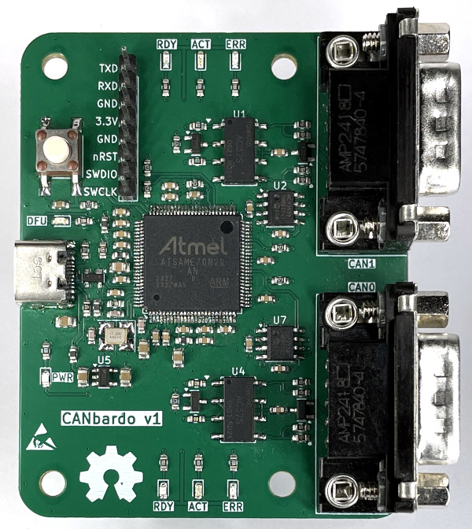

# CANbardo

CANbardo is an open hardware Universal Serial Bus (USB) to Controller
Area Network (CAN) adapter board. It is designed to be compatible with
the open source
[CANnectivity](https://github.com/CANnectivity/cannectivity) firmware.

CANbardo is licensed under the [CERN-OHL-P-2.0 license](LICENSE).

## Hardware Features

The CANbardo board provides the following features:

- Atmel SAME70N20B microcontroller
- 12 MHz 10 ppm crystal
- CAN classic support
- CAN FD (flexible data rate) support
- Fast-speed and Hi-speed USB 2.0 support (USB-C connector)
- Two independent CAN channels (DB-9M connectors)
- 2 x GPIO-controlled MCP2558FD CAN transceivers
- 2 x GPIO-controlled 120 ohm CAN bus termination resistors
- GPIO-controlled LEDs:
  - 2 x CAN channel state LEDs (green)
  - 2 x CAN channel activity LEDs (yellow)
  - 2 x CAN channel error LEDs (red)
  - 1 x Device Firmware Upgrade (DFU) LED (yellow)
- Power LED (green)
- Device Firmware Upgrade (DFU) push button
- Serial Wire Debug (SWD) and UART (3V3) available on header

## Design Documentation

The following design documentation is available:

- [Schematic](Documents/CANbardo_Schematic.pdf)
- [Layout](Documents/CANbardo-Layout.pdf)
- [3D model](Documents/CANbardo.step)
- [KiCad files](Kicad_8_files)
- [Fabrication files](Fabrication_files)
- [3D view](Documents/3D_view.png)
